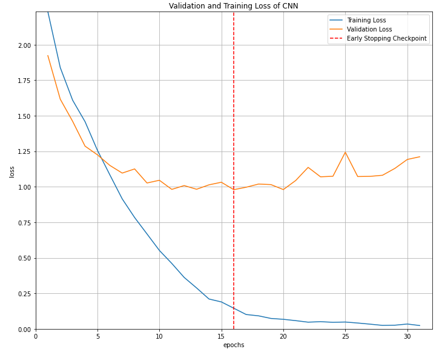
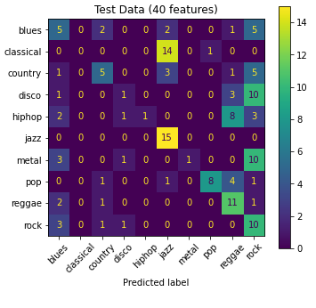

# Music Genre Classifiction using CNN 
Assignement for the course "Machine Learning" offered by the Master's program in *Data Science and Machine Learning* of the National Technical University of Athens (NTUA). 

# Abstract
In this project, the classification of audio signals into musical genres is explored,
using the "GTZAN Genre Collection" Dataset. The approach chosen to achieve this is extracting Mel
Frequency Cepstral Coefficients (MFCC) features from audio tracks with the help of Convolutional
Neural Networks (CNN). CNNs were chosen as a method of feature extraction since they have been
largely adopted in the field of music information retrieval, not only in relation to genre classification,
but also in mood detection and chord recognition.

# DataSet
The dataset used in this paper is the *GTZAN Genre Collection*. MFCCs were extracted from the data and used as input for the CNN. Two models were trained, the first using 13 MFCCs and the second using 40.

# CNN Model
Pytorch was used to implement the CNN model. Some results are presented.

And the confusion matrix based on the predictions on the test data (15%) using the aformentioned model:

